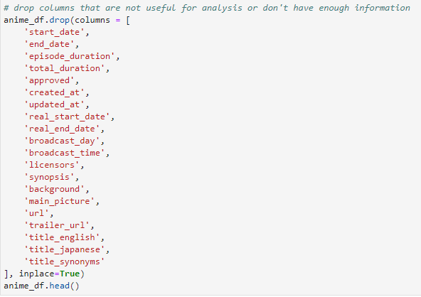

## Description of Data Cleaning & Exploration
* Drop columns that are not useful for analysis or didn't have enough information to be utilized

* Visualize source value counts

* Bin sources into Original and Non-original
* Drop rows with null values
* Convert score, episode, and date floats into integers
* Visualize score value counts

* Bin scores into Average and High
* Separate list-like columns of genre, themes, demographics, studios, producers, and licensors into individual columns; drop those columns with too little information to be used

* Re-name NaN values in demographics column as None

* Divide data into CSVs for database creation
