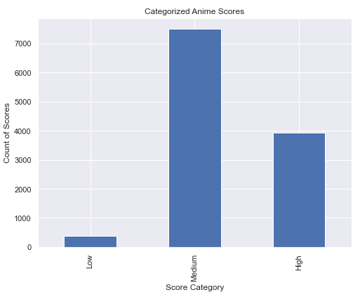
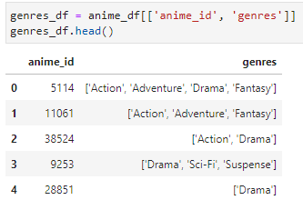

## Description of Data Cleaning & Exploration

### Clean-Up
Initial preprocessing stops included determining which columns were not useful for our analysis or had too many null values to be used. 
* Since our target variable was the score, we dropped rows that didn’t include scores.
* Some of the columns were MAL metadata that didn’t have much relevance for our research, such as whether or not the anime entry was approved and when it was created. We dropped these columns entirely. 
* Columns like synopsis, background, url, and additional titles were interesting, but contained too much categorical data to be utilized for this current project.
* Although we really wanted to use broadcast_day and broadcast_time, 87% of the rows didn’t contain this information. This is probably for a couple reasons. First, some of the shows have been running for decades and have certainly been broadcast at different times through their lifecycle. Second, the new era of streaming has altered the way viewers consume content, making the broadcast columns less relevant for modern anime. 
* Some of the columns included information that was presented in a more user-friendly way in a different column. There was no need to have a SFW column, for example, when we already had a ratings category. Any anime rated R and higher could be assumed to be not safe for work. 
* Finally, we also dropped some of the null rows, although we used binning and renaming to keep some of the null values which told an important story regarding the data, such as those in the demographics column.

### Data Exploration
The correlation matrix showed us that there was correlation between the scored_by, members, and favorites variables. 

The source/score distribution showed that web_novels receive the highest scores, followed by the more traditional mediums of manga, visual_novel, and light_novel. 

The type of anime didn’t make as much of an impact on the score, although movies and tv shows, the two most common type of anime production, edged out the rest of the special types like OVA and ONA. 

Finally, the rating of the anime also had some impact on the overall score, in that the two extremes, G and X ratings, scored the lowest, whereas R and PG13 scored the highest. 

### Binning Sources
The source columns contained a lot of different sources. We theorized that an anime would score higher if it it was created from an already existing source like a manga, novel, or game, as opposed to an anime that was created from scratch without any pre-established fanbase. In order to test this, we binned the sources into original and non-original. 

Once the sources were binned, we determined that anime that were made from non-original sources did score higher than those anime that come from original sources. 

### Binning Scores
The score column included user reviews ranging from 1-10 and these reviews were averaged into float values. We started out binning these into low, medium, and high scores, but found that there were very few low scores, a ton of medium scores, and a middling number of high scores. Therefore we decided to make this binary and divided into average and high. 

### List Columns
One of the biggest challenges of the preprocessing was that several of the columns that we wanted to use for analysis were in list format. These columns were demographics, genres, themes, studios, producers, and licensors. Each of these needed to be separated, analyzed, and recombined in order to give us clean data. 

### Rename NaN Values
It was important to note the animes that are not constrained to a specific demographic, so we renamed all of the NaNs in that column as None. 

