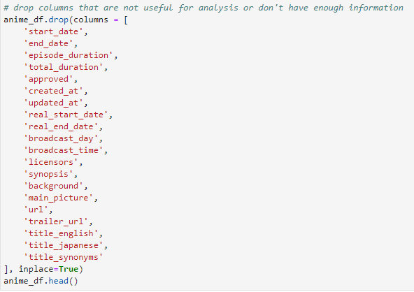
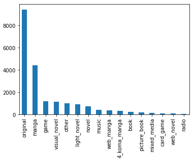
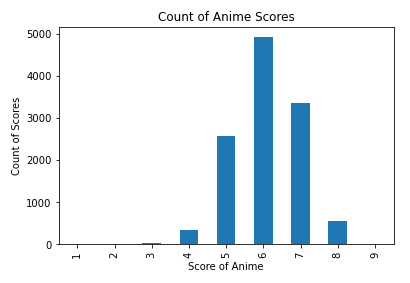
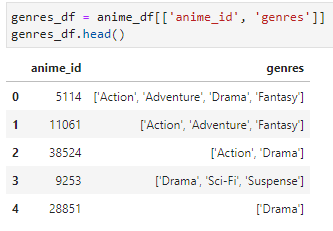
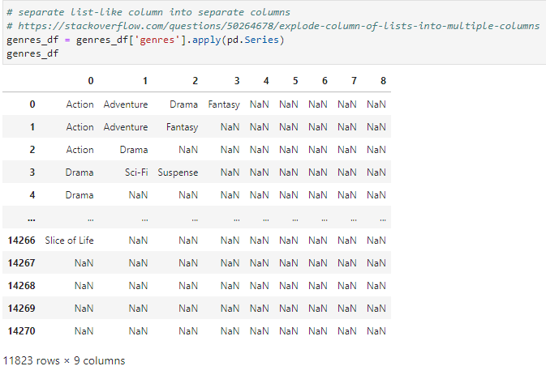
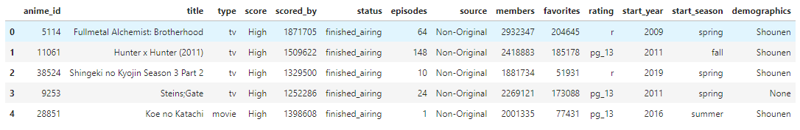
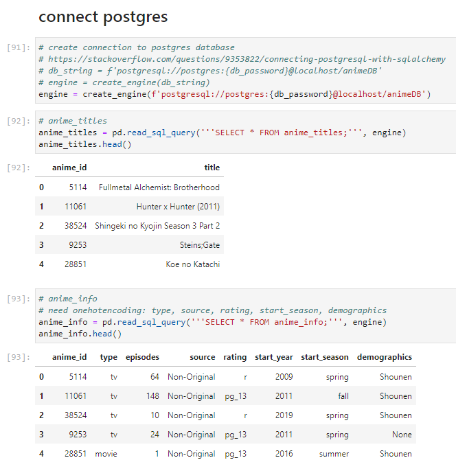

# Analyzing and Predicting Anime Reviews

## Presentation
[link to Google Slide](https://docs.google.com/presentation/d/1_hMblo0-NbiRcU7oeg283wMRgKTc03x0-ilbHuAfsQU/edit#slide=id.p)

## Selected topic
  - The Fighting Gokus chose to use an anime dataset for the final project.

### Reason for selected topic
  - Our team is interested in popular culture and the ways that cultural data can be analyzed. In addition, we all have some level of interest in anime. 
  - Product reviews are important sources of insider information that can be used to guide future development. In this study, our goal is to see if relevant features can be used to predict the success of future anime releases.

### Description of data source
  - We chose to work on an anime dataset. This dataset consists of data scraped from MyAnimeList.com (MAL), one of the most active anime and manga communities online. It was originally composed of 24,166 rows and 39 columns, including features such as anime_id, title, type, score, source, total episodes, rating, genres, demographics, studios, and more. 
  - From Kaggle, [link to dataset](https://www.kaggle.com/datasets/andreuvallhernndez/myanimelist). 
* Questions to answer from data
  - What features have the most impact on the review score?
  - Is there a way to predict the success of an anime using the features in the MAL database?

### Communication protocols
  - The group has a dedicated Slack groupchat to communicate outside of the normal class schedule. 
  - We are using class time to work on the project together as needed. 
  - Extra meetings have been scheduled when needed. 

### Team member responsibilities
- Megan Reid - Git and technology wrangler
- Rachel Tait-Ripperdan - preprocess data and create database
- Jared Toomey - dashboard
- Luis Zavala - machine learning 

## Key Technologies Used
* Jupyter, Pandas, Google Colab
* PostGres SQL Database
* SciKitLearn
* Tableau

## Description of Data Cleaning & Exploration
* Drop columns that are not useful for analysis or didn't have enough information to be utilized

* Visualize source value counts

* Bin sources into Original and Non-original
* Drop rows with null values
* Convert score, episode, and date floats into integers
* Visualize score value counts

* Bin scores into Average and High
* Separate list-like columns of genre, themes, demographics, studios, producers, and licensors into individual columns; drop those columns with too little information to be used

* Re-name NaN values in demographics column as None

* Divide data into CSVs for database creation

## Description of Database Process

## Description of Machine Learning Process

## Description of Dashboard Creation Process