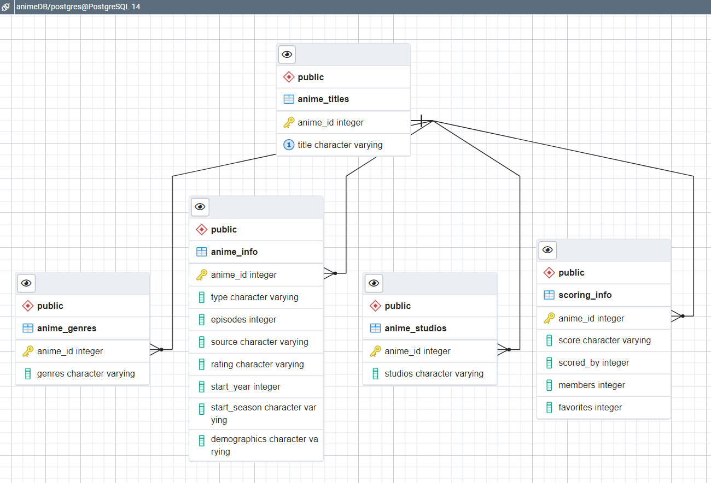
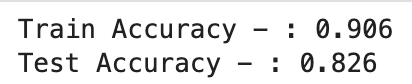
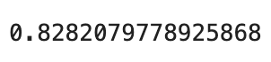
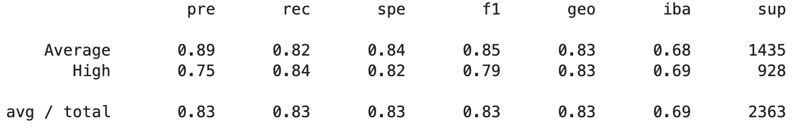

# Analyzing and Predicting Anime Reviews

## Presentation
[link to Google Slide](https://docs.google.com/presentation/d/1_hMblo0-NbiRcU7oeg283wMRgKTc03x0-ilbHuAfsQU/edit#slide=id.p)

## Selected topic
  - The Fighting Gokus chose to use an anime dataset for the final project.

### Reason for selected topic
  - Our team is interested in popular culture and the ways that cultural data can be analyzed. In addition, we all have some level of interest in anime. 
  - Product reviews are important sources of insider information that can be used to guide future development. In this study, our goal is to see if relevant features can be used to predict the success of future anime releases.

### Description of data source
  - We chose to work on an anime dataset. This dataset consists of data scraped from MyAnimeList.com (MAL), one of the most active anime and manga communities online. It was originally composed of 24,166 rows and 39 columns, including features such as anime_id, title, type, score, source, total episodes, rating, genres, demographics, studios, and more. 
  - From Kaggle, [link to dataset](https://www.kaggle.com/datasets/andreuvallhernndez/myanimelist). 
* Questions to answer from data
  - What features have the most impact on the review score?
  - Is there a way to predict the success of an anime using the features in the MAL database?

### Team member responsibilities
- Megan Reid - Git and technology wrangler
- Rachel Tait-Ripperdan - preprocess data and create database
- Jared Toomey - dashboard
- Luis Zavala - machine learning 

## Key Technologies Used
* Jupyter, Pandas, Google Colab
* PostGres SQL Database
* SciKitLearn
* Tableau

## Data Preprocessing

For a full breakdown of preprocessing, visit the [README](https://github.com/Megreid23/final_project/blob/9ff692bcb00bf8446f2d7f335def67ebeb1562bc/Exploratory_Data_Analysis/README.md) and investigate the [Notebook](https://github.com/Megreid23/final_project/blob/9ff692bcb00bf8446f2d7f335def67ebeb1562bc/Exploratory_Data_Analysis/anime_project.ipynb).

## Database
The database was created in PostgresSQL and connected through SQLAlchemy. 

## Machine Learning

* Using a binary classification model (BalancedRandomForestClassifier) we are inputting our features in order to determine if they have any correlation with predicting the score the Anime has been given.

* Using scikit learn we implemented train test split in order to split the data in the machine learning model. 

### Machine Learning Results
* After cross validating the model with RandomizedSearchCV we were able to produce a balanced accuracy score of (~.83).

### Reviewing our results through the lens of the F1 score. 
* The F1 score shows us the balance between precision and recall.

* At a F1 score of .85 it shows the model was able to achieve a good result predicting our classification model in both recall and precision. 

## Dashboard
[Link to Full Interactive Dashboard](https://public.tableau.com/shared/CH5JW3NY8?:display_count=n&:origin=viz_share_link)
